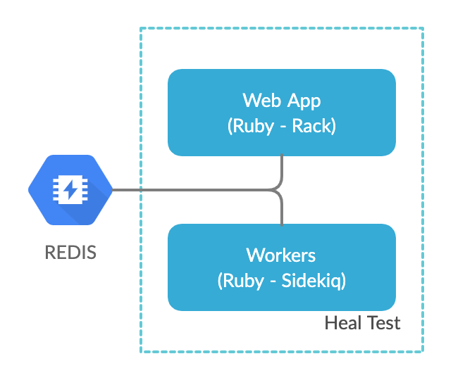

# Heal Test Application
The goal of this project is to have the candidate demonstrate the ability to take a standard web application and generate the appropriate files (Docker/Terraform) files required to deploy. In addition, provide methodology, either in code or written, on how secret credentials such as database urls can be retrieved from Vault or some other secret mechanism.

We will provide instructions on how to run the application locally. The candidate should be able to take this application repository and provide files necessary to deploy the application.



# Requested Deliverables
The expected deliverables from this test are:

1. A Dockerfile or docker-compose.yml that can be used to build a container of this Ruby application.
2. A Terraform configuration (https://www.terraform.io/) used to deploy the application.
4. A method for correctly and securely provisioning the MONGODB_URI and REDIS_URL environment variables. This could potentially use Hashicorp Vault.
5. Provide a write up regarding the solution.

We should be able to utilize the files you provide and dockerize the applicatin.

# Dependencies
1. Ruby 2.6 or later
3. REDIS Server - url to be provided as the environment variable REDIS_URL

# Setup Running Locally
To run the application locally, you should have a version of Ruby installed on your system. We recommend installing RVM: https://rvm.io . You can do so with the command below:

```
$ \curl -sSL https://get.rvm.io | bash -s stable
```

Once you have Ruby 2.6 installed, you can install the applications dependencies:

```
$ gem install bundler puma foreman
$ bundle install
```

Make sure redis is running on port 6379:

```
$ brew install redis
$ brew services start redis
```

The command to start all services, you can use:
```
$ bundle exec foreman start
```

To start each process individually, you can use these commands:

```
# Web process
$ bundle exec puma -C config/puma.rb
# Worker process (Sidekiq)
$ bundle exec sidekiq start -r ./config/boot.rb -C ./config/sidekiq.yml
```

# Testing Running Locally
Once the application is running on the specific port, you can test enqueing an asynchronous task through `GET /` API, and the Sidekiq process should pick up and perform the operation asynchronously.